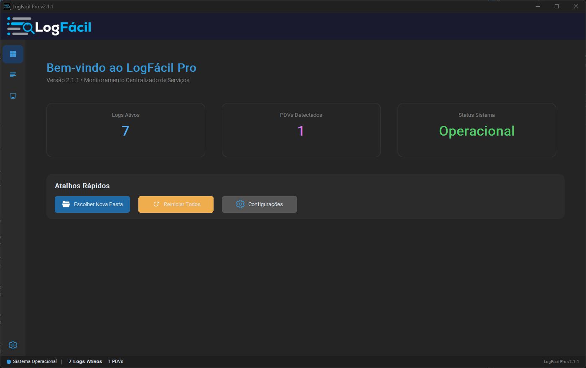
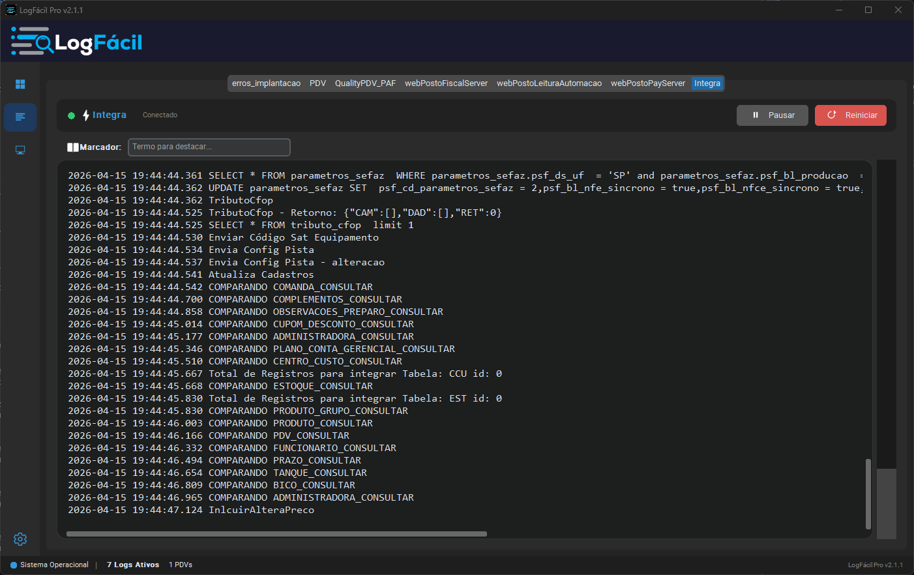
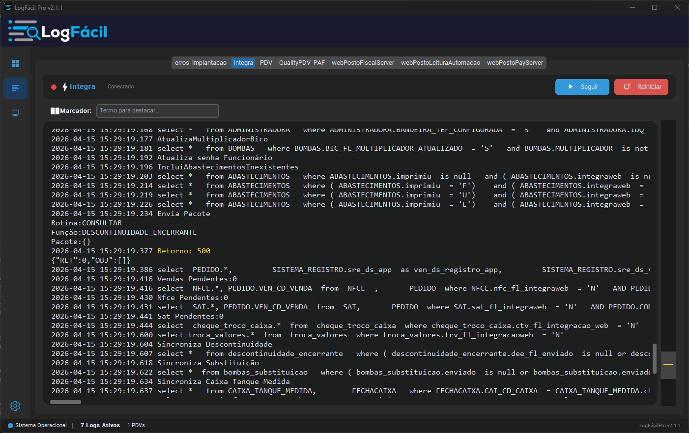

# 📋 LogFacil – Sistema Inteligente de Consulta de Logs

# 📌 LogFacil

## 🧾 Sobre o Projeto

O **LogFacil** é uma solução desenvolvida pela **MaxInnov** com o objetivo de otimizar e acelerar o suporte técnico por meio da análise inteligente de logs.

A ferramenta atua como um **facilitador operacional**, centralizando e estruturando informações que normalmente estariam dispersas em múltiplos arquivos e diretórios. Com isso, reduz significativamente o tempo necessário para diagnóstico e resolução de incidentes.

💡 Em vez de depender de navegação manual, comandos técnicos ou análise fragmentada, o técnico passa a contar com uma visão clara, objetiva e organizada dos eventos do sistema.

---

## 🖼️ Interface do Sistema

### Dashboard / Visão Geral

### Consulta de Logs

### Detalhamento de Eventos

> 📌 *As imagens acima representam o fluxo principal de utilização do sistema.*

---

## ⚠️ Aviso Importante (Responsabilidade, Independência e Privacidade)

O LogFacil foi desenvolvido com foco em **segurança, transparência e uso não intrusivo**.

**O sistema:**

❌ Não possui qualquer vínculo oficial, integração nativa ou afiliação com o sistema WebPosto da Quality  
❌ Não altera, modifica ou interfere no funcionamento do WebPosto  
❌ **Não realiza qualquer tipo de coleta, armazenamento externo ou compartilhamento de dados**  
✅ Atua exclusivamente como ferramenta auxiliar de consulta e análise de logs  
✅ Processa informações **apenas localmente**, utilizando arquivos já existentes no ambiente  
✅ Não envia dados para servidores externos ou serviços de terceiros  
✅ Tem como único objetivo **auxiliar o técnico na identificação de problemas e tomada de decisão**

👉 Em resumo: o LogFacil é uma ferramenta independente, segura e 100% local, voltada exclusivamente para diagnóstico.

---

## 🚀 Funcionalidades

### 🔍 Consulta Unificada de Logs  
Interface web simples e objetiva para busca por data, hora, componente ou tipo de erro.

### 🤖 Coleta Automatizada  
Leitura contínua de logs provenientes de múltiplas fontes (Integra, PulserWeb, PDVs, PAYs, bombas, entre outros), sem necessidade de intervenção manual.

### 📍 Identificação de Origem  
Rastreamento rápido da origem dos eventos (PDV, PAY ou outros dispositivos), facilitando a análise de incidentes.

### 🧠 Base de Conhecimento de Erros  
Correlação de erros com possíveis causas e sugestões de solução com base em ocorrências já catalogadas.

### ⚡ Ganho Real de Produtividade  
Elimina a necessidade de comandos como `tail`, acesso manual a diretórios ou análise descentralizada.

### 🔔 Alertas Inteligentes  
Notificações para eventos críticos previamente definidos, permitindo atuação proativa.

---

## 🎯 Objetivo

O LogFacil foi projetado para:

- Reduzir drasticamente o tempo de diagnóstico  
- Padronizar a análise de logs  
- Aumentar a eficiência operacional do suporte técnico  
- Minimizar erros humanos na interpretação de informações  

---

## 💾 Download (Windows)

Para utilizar o sistema sem necessidade de instalação de dependências:

👉 https://github.com/ejcastro1090/logfacil/releases/latest

---

## 🧩 Stack Tecnológica

- **Backend:** FastAPI  
- **Frontend:** Vue.js  
- **Linguagem:** Python 3.8+  

---

## 📈 Visão

O LogFacil segue um princípio simples e direto:

> **Menos tempo procurando, mais tempo resolvendo.**

A proposta é evoluir continuamente como uma ferramenta essencial no dia a dia do suporte técnico.

---

## 💡 Apoie o Projeto

Se o LogFacil gera valor no seu dia a dia e você deseja apoiar sua evolução:

👉 **PIX:** contato@maxinnov.com.br  

---

## 📄 Licença

Este projeto está licenciado sob a **MIT License**. Consulte o arquivo `LICENSE` para mais detalhes.